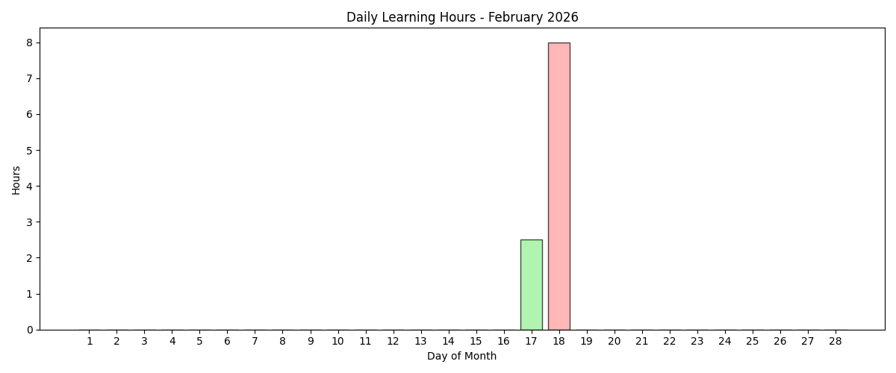

# AI Learning Journey

---

# 🤖 My AI Learning Journey

Welcome to my personal repository documenting my **learning journey in Python and Artificial Intelligence**.  
Here I collect exercises, notes, mini-projects, and experiments from various sources, including online courses, tutorials, and hands-on practice.  
This repository serves both as a **learning log** and a **showcase of my growing skills** in coding, AI concepts, and practical applications.

---

## 📚 Repository Contents

This repository includes:
- 📂 **Weekly folders** with lessons and practice files  
- 📝 **Notes and summaries** for each session  
- 🛠️ **Exercises and hands-on projects**  
- 📦 **Additional resources and references**

---

## 🎯 Objectives

The main objectives of this repository are:

1. **Learn coding and conceptual fundamentals** through structured exercises and real examples.  
2. **Build a strong foundation in AI concepts** and practical applications.  
3. **Document learning progress** for self-review and future reference.  
4. **Experiment with small projects** to apply concepts in practice.  
5. **Share knowledge and resources** with others interested in Python and AI.

---

## 🧑‍💻 Tools & Technologies

- **Python 3.x**  
- **VS Code / PyCharm**  

---

# 📅 My Daily Learning Log

---

## 📬 Contact

If you'd like to collaborate or learn together, feel free to get in touch!

---
# 🗂 Content Organization

<!-- DIRSTRUCTURE_START_MARKER -->
<pre>
My_Way_to_Ai/
│
├── basics/
│   ├── note.md
│   └── PYTHON_COURSE_TVTO/
│       ├── note.md
│       ├── week00/
│       │   ├── note.md
│       │   ├── session01/
│       │   │   ├── get_user_name.py
│       │   │   ├── hello_world.py
│       │   │   └── note.md
│       │   └── session02/
│       │       ├── compare_number.py
│       │       ├── grade_evaluater.py
│       │       ├── note.md
│       │       └── registeration_age_checker.py
│       ├── week01/
│       │   ├── session03/
│       │   │   ├── calculator.py
│       │   │   ├── note.md
│       │   │   ├── positiveNumber.py
│       │   │   └── rangeOfNumber.py
│       │   └── session04/
│       │       ├── absoluteNumber.py
│       │       ├── multiplicationTable.py
│       │       ├── note.md
│       │       └── sumAllEvenNumber.py
│       ├── week03/
│       │   ├── session07/
│       │   │   ├── note.md
│       │   │   └── tuple.py
│       │   ├── session08/
│       │   │   └── list.py
│       │   └── session09/
│       │       └── countriesDic.py
│       ├── week04/
│       │   ├── session10/
│       │   │   └── rectangleGeometryOpp.py
│       │   └── session11/
│       │       └── shapeInheritance.py
│       ├── week05/
│       │   ├── session12/
│       │   │   ├── my_file.txt
│       │   │   └── textViewer.py
│       │   └── session13/
│       │       └── regularExpressions.py
│       └── week06/
│           └── installPackages.py
│  
├── machineLearning/
│   ├── note.md
│   ├── week00/
│   │   ├── note.txt
│   │   ├── session01/
│   │   │   └── my_script.R
│   │   └── session02/
│   │       └── cal.py
│   ├── week01/
│   │   ├── session03/
│   │   │   ├── fileCreation.py
│   │   │   └── printOnetoOneHundred.py
│   │   ├── session04/
│   │   │   └── campareDatastructure.py
│   │   └── session05/
│   │       ├── note.txt
│   │       ├── studentGraph.py
│   │       └── studentGraph.R
│   └── week02/
│       └── session07/
│           └── binarySearch.py
└── README.md

</pre>
<!-- DIRSTRUCTURE_END_MARKER -->

---
> 💡Note: This repository is a personal educational log._
---
